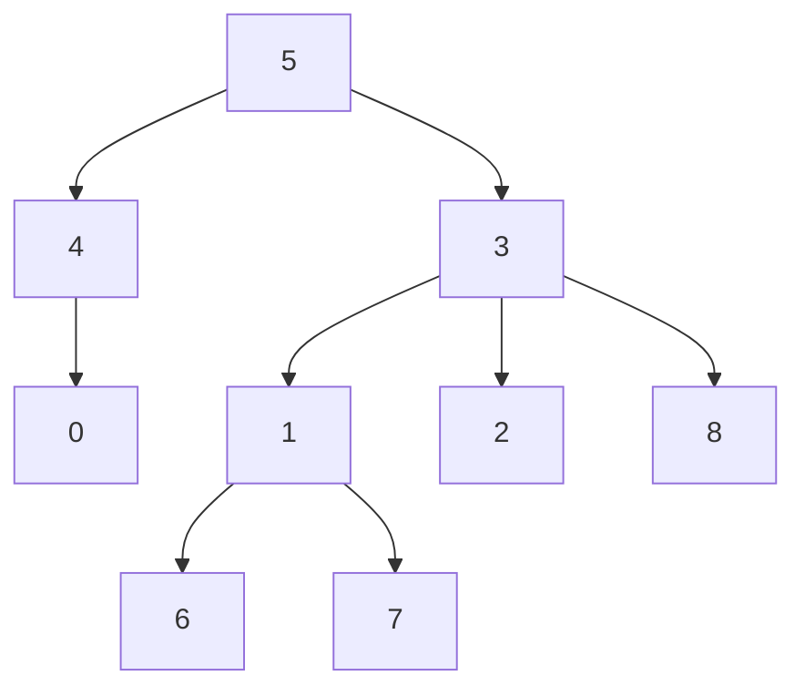
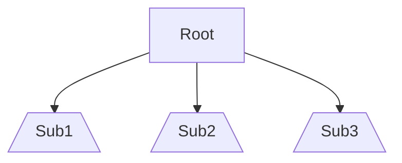
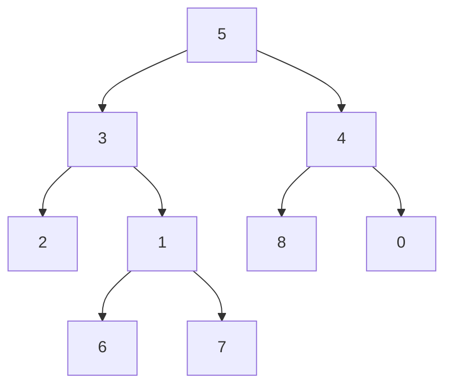
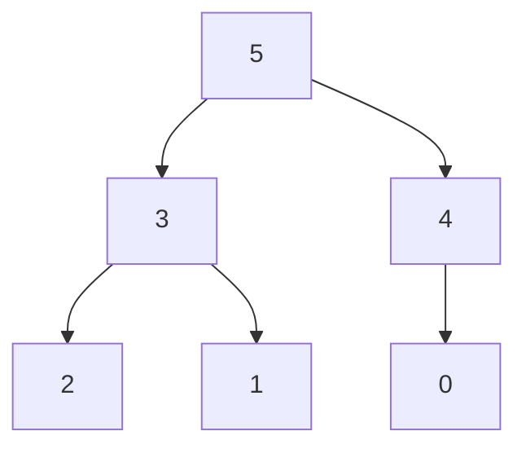
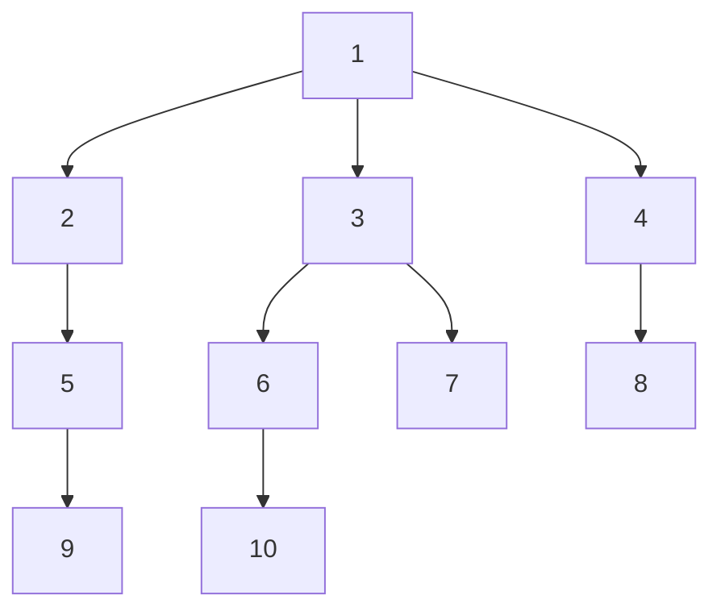
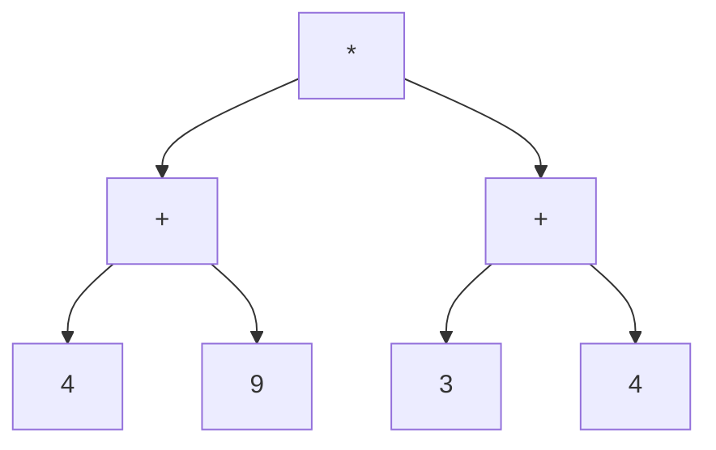

# Alberi

Contenuti della lezione
1. [Definizione](#definizione)
2. [Memorizzazione](#memorizzazione)
3. [Visite](#visite)

## Definizione

### Definzione classica

Un albero consiste di un insieme di nodi e un insieme di archi
orientati che connettono coppie di nodi, con le seguenti proprietà:

* Un nodo dell’albero è designato come nodo **radice**;
* Ogni nodo n, a parte la radice, ha esattamente un arco
entrante;
* Esiste un **cammino unico** dalla radice ad ogni nodo;
* L’albero è **connesso**.



### Definizione ricorsiva:
Un albero è dato da:
* un insieme vuoto, oppure
* un nodo radice e zero o più sottoalberi, ognuno dei quali è un
albero; la radice è connessa alla radice di ogni sottoalbero con
un arco orientato.



### Caratteristiche

**Altezza**: lunghezza del cammino semplice dalla radice al nodo (misurato in numero di archi).

**Livello**: l’insieme di nodi alla stessa profondità.

**Altezza albero**: la profondità massima della
sue foglie.

### Alberi Binari

Un albero binario è un albero radicato in cui ogni nodo ha al massimo due figli, identificati come figlio sinistro e figlio destro.



## Memorizzazione

Prendiamo in considerazione quest'albero:



E definiamo **N** come il numero dei nodi nell'albero, in questo caso 6.

### Vettore dei padri

Abbiamo un vettore di interi di dimensione N. L'elemento in posizione **i**-esima indica chi è il padre di **i**.

| Indice | 0 | 1 | 2 | 3 | 4 | 5 | 
| - | - | - | - | - | - | - |
| Padre | 4 | 3 | 3 | 5 | 5 | -1 |

### Vettore per albero binario

Questa opzione è possibile **solo** per alberi binari poiché assume che ogni nodo abbia al massimo due figli.

In posizione 1 abbiamo la radice. Dato l'indice **i** di un elemento possiamo sapire chi sono i suoi due figli in questo modo:

Figlio sinistro: **i** * 2

Figlio destro: **i** * 2 + 1

| Indice | 0 | 1 | 2 | 3 | 4 | 5 | 6 | 7 |
| - | - | - | - | - | - | - | - | - |
| Nodo | - | 5 | 3 | 4 | 2 | 1 | 0 | - |

É come se noi copiassimo livello per livello, partendo dalla radice, i nodi dell'albero.
Il vettore sarà grande quanto la prima potenza di due >= del numero dei nodi;

### Vettore di vettori

Ogni nodo avrà un vettore associato in cui verranno inseriti i suoi figli. Ovviamente i vettori avranno dimensione differente.

| Indice |  |  |
| - | - | - |
| 0 |
| 1 |
| 2 |
| 3 | 2 | 1 |
| 4 | 0 |
| 5 | 3 | 4 |

<details>
<summary>Implementazione</summary>

```c++
struct Edge {
	int n, w;
};

class Graph {
protected:
	int N;
	vector<vector<struct Edge>> edges;
public:
	Graph(int N) {
		this->N = N;
		edges.assign(N, vector<struct Edge>());
	}

	size_t size() {
		return this->N;
	}

	void insertEdge(int a, int b) {
		insertEdge(a, b, 1);
	}

	void insertEdge(int a, int b, int w) {
		struct Edge e = {b, w};
		edges[a].push_back(e);
	}

	vector<struct Edge> adj(int n) {
		return edges[n];
	}
};
```

Utilizzo:
```c++

Graph g(N); // creo un albero di dimensione N

g.size(); // ritorna la dimensione

g.insertEdge(0, 1); // a è padre di b

g.insertEdge(0, 1, 12); // come sopra, ma aggiungo anche un'informazione in più

g.adj(0); // ritorna un vettore dei figli (struct Edge)
```
</details>


## Visite

Una strategia per analizzare (visitare) tutti i nodi di un albero.
Siccome ogni nodo viene visatato esattamnte una sola volta, il costo di qualunque visita è esattamente O(n).
  
Prendiamo in considerazione quest'albero:



### BFS: Breadth First Search

Ogni livello dell’albero viene visitato, uno dopo l’altro
Si parte dalla radice.
Richiede una queue.


| bfs: | 1 | 2 | 3 | 4 | 5 | 6 | 7 | 8 | 9 | 10 |
| - | - | - | - | - | - | - | - | - | - | - |

```c++
queue<int> coda;
coda.push(root);

while (coda.empty() == false) {
    auto top = coda.front();
    coda.pop();

    for (auto a: g.adj(top)) {
        cout << a.n << endl;
        coda.push(a.n);
    }
}
```

### DFS: Depth First Search

Per visitare un albero, si visita ricorsivamente ognuno
dei suoi sottoalberi.
Tre varianti: pre/in/post visita (pre/in/post order).
Richiede uno stack.

#### Generica (Stack implicito)

In questo caso, sfrutta lo stack delle funzioni.

```c++
void dfs(int node) {
    // pre visita
    for (auto a: g.adj(node)) {
        dfs(a.n);
        // post figlio
    }
    // post visita
}
```

| pre visita: | 1 | 2 | 5 | 9 | 3 | 6 | 10 | 7 | 4 | 8 |
| - | - | - | - | - | - | - | - | - | - | - |

| post visita: | 9 | 5 | 2 | 10 | 6 | 7 | 3 | 8 | 4 | 1 |
| - | - | - | - | - | - | - | - | - | - | - |

#### Stack esplicito

```c++
stack<int> pila;
pila.push(root);

while (pila.empty() == false) {
    auto top = pila.top();
    pila.pop();

    for (auto a: g.adj(top)) {
        // pre visita
        pila.push(a.n);            
    }
}
```
Q: Post visita?

### Pre

Le operazioni eseguite prima della visita dei figli.

Esempio: cammini minimi.

### Post

L'insieme delle operazioni eseguite dopo la visita di tutto il sottoalbero.

Esempio: Se noi volessi conoscere il risultato della seguente espressione: ((4+9) * (3+4)). 



### Mid (solo per alberi binari)

In un albero binario, sono le operazioni eseguite tra la visita del sottoalbero sinistro e quello destro.

Esempio: Se volessi stampare l'espressione presente nell'albero appena sopra. 

## Contest

Il contest lo trovate [qui](https://www.palestradialgoritmi.fun/school/russel). Inizia alle 15:30.