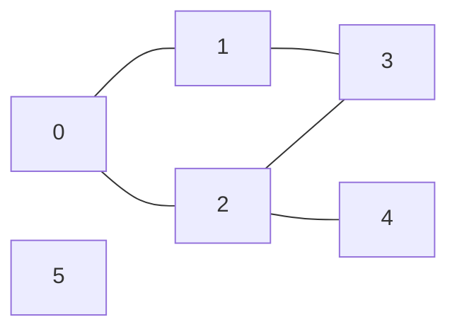
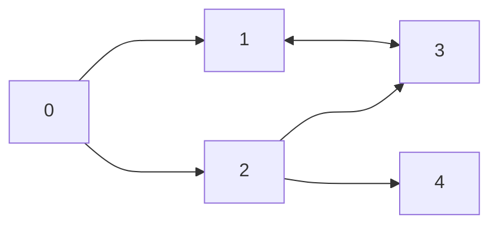
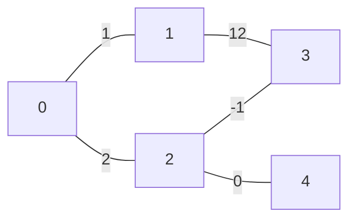
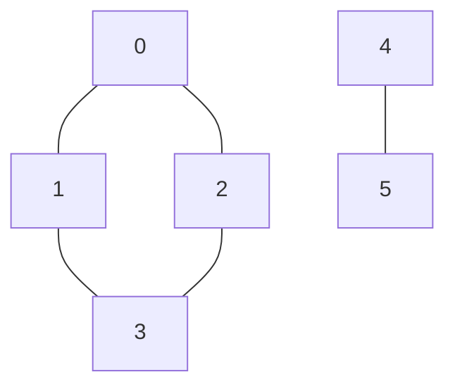

# Grafi

Contenuti della lezione
1. [Definizione](#definizione)
2. [Memorizzazione](#memorizzazione)
3. [Visite](#visite)

[Qui](https://palestradialgoritmi.fun/school/russel#/contest/graph) trovate il contest.

## Definizione

Un grafo G è una coppia (V, E) dove:
- V è un insieme di nodi (node) o vertici (vertex);
- E è un insieme di coppie (u, v) di nodi dette archi (edge).

Esempio:
- V = { 0, 1, 2, 3, 4, 5 }
- E = { (0, 1), (0, 2), (1, 3), (2, 3), (2, 4) }



Per comodità, definiamo:
- N = |V| numero di nodi
- M = |E| numero di archi

### Orientati

Gli archi hanno una direzione, quindi non sono "percorribili" in entrambi i versi.



### Pesati

Nei grafi pesati ad ogni arco è associato un peso (può essere anche negativo).



## Memorizzazione

Prendiamo in considerazione questo grafo:


### Matrici di adiancenza

Inseriamo 1 se esiste il collegamento tra u e v, 0 altrimenti.

|   | 0 | 1 | 2 | 3 | 4 |
|---|---|---|---|---|---|
| 0 | 0 | 1 | 1 | 0 | 0 |
| 1 | 0 | 0 | 1 | 0 | 0 |
| 2 | 0 | 0 | 1 | 1 | 0 |
| 3 | 0 | 0 | 1 | 1 | 0 |
| 4 | 0 | 0 | 1 | 1 | 0 |

Su grafi non orientati la matrice è simmetrica sulla diagonale.
Ottimale per sapere in O(1) se due nodi sono connessi, mentre non è ottimale per lo scorrimento degli adiacenti.

### Vettore di vettori

Se u e v sono connessi, inseriamo v nel vettore degli adiacenti di u (anche viceversa se il grafo non è orientato).

| Nodo | Adiacenti |
|-|-|
|0| [0, 1] |
|1| [0, 3] |
|2| [0, 4] |
|3| [1, 2] |
|4| [2] |
|5| [] |

Ottimale per scorrere tutti gli adiacenti, **non ottimale per sapere in O(1)** se due nodi sono connessi oppure no.

## Visite

Una strategia per analizzare (visitare) tutti i nodi di un grafo.

Ogni nodo viene visitato una sola volta, ma a differenza degli alberi in cui M = N - 1, nei grafi M potrebbe essere molto più grande di N, quindi va tenuto in considerazione nel calcolo del costo, che viene quindi **O(N + M)**.

### BFS

Visitiamo il grafo in ampiezza, partendo da un nodo sorgente e visitando tutti i nodi a distanza 1 dalla radice, poi quelli a distanza 2 e così via. Quindi ci permette di **visitare i nodi a distanze crescenti dalla radice**.

Ovviamente, a differenza degli alberi, ci possono essere moltiplici radici da cui far partire la visita.

Per effettuarla abbiamo bisogno di una coda FIFO.

```c++
void BFS(Graph G, int r) {
    auto Q = queue<int>();
    auto visited = vector<bool>(G.size(), false);

    visited[r] = true;
    Q.push(r);

    while (!Q.empty()) {
        auto u = Q.front();
        Q.pop();
        for (auto v : G.adj(u)) {
            // controllo se sono già passato da qui
            // altrimenti potrei entrare in un ciclo infinito
            if (!visited[v]) {
                visited[v] = true;
                Q.push(v);
            }
        }
    }
}
```

**Esempio**: Erdos

Erdos è un matematico ungherese che ha scritto tantissimi articoli e ha avuto tantissimi collaboratori.
Per questo motivo è stato inventato il **numero di Erdos** che segue queste regole:
- Erdos ha numero 0;
- i collaboratori di Erdos hanno numero 1;
- se un autore X ha collaborato con un autore Y che ha numero k, allora X ha numero k + 1;
- tutte le persone non raggiungibili da Erdos hanno numero infinito.

Soluzione: eseguiamo una BFS e assegno ad ogni adiacente non ancora visitato la distanza del nodo corrente + 1.

```c++
void BFSErdos(Graph G, int r) {
    auto Q = queue<int>();
    // inizio con tutti a -1 per indicare che non sono stati visitati
    auto dist = vector<int>(G.size(), -1);

    dist[r] = 0;
    Q.push(r);

    while (!Q.empty()) {
        auto u = Q.front();
        Q.pop();
        for (auto v : G.adj(u)) {
            // controllo se sono già passato da qui
            if (dist[v] == -1) {
                // se non sono passato da qui, allora la distanza è quella del padre + 1
                dist[v] = dist[u] + 1;
                Q.push(v);
            }
        }
    }
}
```
Alla fine possiamo vedere erdos come una specie di cammini minimi con distanze unitarie.

### DFS

Visitiamo il grafo in profondità, cioè partendo da un nodo sorgente, visito ricorsivamente tutti i suoi adiacenti, poi tutti i loro adiacenti e così via.

Per effettuarla abbiamo bisogno di una pila LIFO.

```c++

auto visited = vector<bool>(G.size(), false);
void DFS(Graph G, int r) {
    visited[r] = true;
    // pre visita
    for (auto v : G.adj(r)) {
        if (!visited[v]) {
            DFS(G, v);
        }
    }
    // post visita
}
```
Come per gli alberi, anche nei grafi possiamo utilizzare uno stack esplicito.

**Esempio**: Componenti connesse su grafo non orientato

Le componenti connesse sono sottoinsiemi di nodi disgiunti tali per cui esiste un percorso tra ogni coppia di nodi.
Un grafo si dice connesso se è presente solo una cc.



In questo grafo abbiamo 2 componenti connesse: {0, 1, 2, 3} e {4, 5}.
Se volessimo rendere il grafo connesso, dovremmo aggiungere un arco tra un qualsiasi nodo della prima cc e un qualsiasi nodo della seconda cc.

**Soluzione**: iteriamo su tutti i nodi e se non sono stati visitati, eseguiamo una DFS che identificherà tutti i nodi raggiungibili e assegnerà loro un id che identificherà la cc di appartenenza.

```c++
auto component = vector<int>(G.size(), -1);
auto g = Graph(N);

void ccdfs(int r, int c) {
    component[r] = c;
    for (auto v : G.adj(r)) {
        if (component[v] == -1) {
            ccdfs(G, v, c);
        }
    }
}

void cc() {
    auto c = 0;
    for (auto i = 0; i < G.size(); i++) {
        if (component[i] == -1) {
            c++;
            ccdfs(G, i, c);
        }
    }
}
```

Disclaimer: questo algoritmo funziona solo per grafi **NON ORIENTATI**. Per grafi orientati, bisogna usare un approccio diverso chiamato [Algoritmo di Kosaraju](https://it.wikipedia.org/wiki/Componente_fortemente_connessa).

### Alberi di visita

Indipendenetemente dalla visita che effettuiamo (BFS o DFS), otteniamo un albero di visita, oppure una foresta.